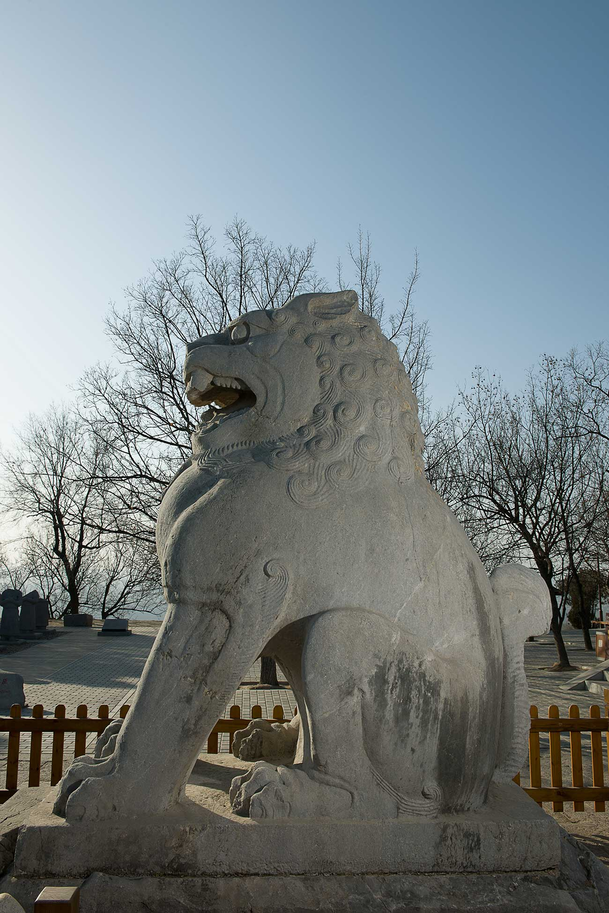
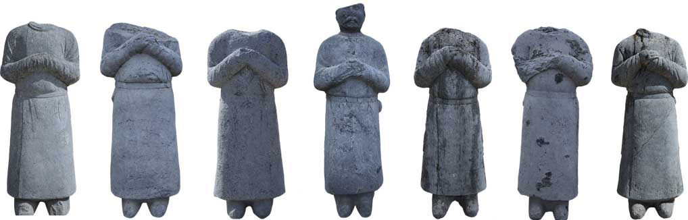
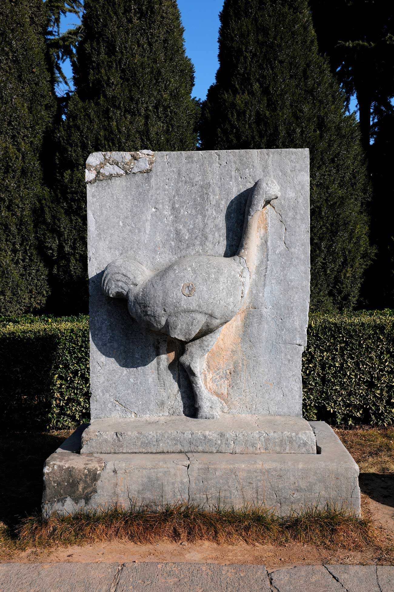

### 唐高宗李治 (公元628年-683年)

李治生于公元628年，字为善，小字雉奴，是唐太宗李世民的第九个儿子。根据北宋李昉、李穆、徐铉等所著的《太平御览》记载，李治幼年“歧嶷端审，宽仁孝友”深得太宗宠爱。公元643年，太子李承乾因谋反被废黜，随后李治被立为皇太子。公元[14]649年，李世民崩逝于翠微宫含风殿，李治即位。

高宗李治即位之初“载怀千古，流鉴百王”。据司马光的《资治通鉴》（卷一九九）评论高宗即位初年为“永徽之政，百姓阜安，有贞观之遗风”。李治晚年罢贬长孙无忌、褚遂良等重臣，于是朝中无人再敢劝谏，朝纲渐乱。显庆五年（660年）以后，高宗经常“风眩头重，目不能视”，无法处理政务。武则天乘机插手政治，开始参与国家大事。公元666年，李治与武则天同登泰山封禅，谒祀孔子，大唐王朝中形成了“二圣”并尊的局面。

公元683年十二月，唐高宗李治崩于东都洛阳的贞观殿，享年五十六岁。中记载高宗临终前说：“天地神祗若延吾一两月之命，得还长安，死亦无恨”。高宗留下遗命，由宰相裴炎辅佐朝政，并留下《大帝遗诏》：“园陵制度，务从节俭。军国大事有不决者，兼取天后进止。”。公元684年，睿宗李旦护送高宗灵驾返回长安，葬于乾陵。

#### 武则天(公元624年～705年)

武则天祖籍并州文水（今山西文水县南徐村），其原名为武照，后改为“武曌”。《旧唐书·则天皇后本纪》记载“太宗闻其美容止，召入宫，立为才人，赐号武媚，时年14岁时。”贞观末年，李世民病重，李治进宫侍奉，“见才人武氏而悦之”。太宗驾崩，李治即位即唐高宗。武则天依唐后宫之例，和部分没有子女的嫔妃们一起入长安感业寺为尼，为先皇祈福。公元652年高宗纳武才人入后宫，封为昭仪，后于公元655年，被封为皇后。公元683年，高宗驾崩，太子李显即位（武则天与高宗所生第三子），武则天以太后身份临朝称制。次年，即废李显为庐陵王，立四子李旦（豫王）为帝。天授元年（公元690年），在百官、黎明百姓及四夷酋长 6万余人的“劝进”之下，67岁的武则天正式登基，改国号为“武周”定洛阳为“神都”，并改百官名称，开启了武则天二十一年的“圣衷独断”时代。武则天称帝后，为了防备唐旧部的反抗，采取残酷的镇压手段，并奖励告密，任用酷吏索元礼，周兴等，屡兴大狱，诛杀唐宗室贵戚、大臣，以维护自己的绝对统治地位。同时她开创殿试制度，不拘一格选用人才，奖励农桑，颁行农书《兆人本业记》，使得贤才辈出；她加强和改善了唐王朝和边疆各少数民族的关系，同时大破吐蕃，收复龟兹、疏勒、于阗、碎叶等安西四镇，设安西都护府于龟兹、设“北庭都护府”于庭州（今新疆吉木萨尔北破城子），使得政治、经济和文化得到了蓬勃发展。但是武则天独断专权，大兴土木，百姓赋役繁重，政宪大乱。神龙元年（705年）武则天病笃，宰相张柬之与大臣敬晖、禁军统领李多祚发动政变，拥中宗李显复位。武则天“遗制附庙、归陵、令去帝号，称则天大圣皇后”。同年十一月，82岁的武则天崩逝于洛阳上阳宫仙居殿。次年，中宗护则天灵柩返回长安，与李治合葬于乾陵玄宫。公元710年睿宗李旦即位，复其号为“天后”，追尊为“大圣天后”，后改尊号为“则天皇太后”。

### 六十一番臣像

“蕃臣”石像在初建时，背部均镌刻着姓名、职衔、族属以及属国国别等文字信息。但在石像建成后的300年后，就因风雨剥蚀而名衔漫漶。元祐四年（1089），北宋名臣游师雄采用“摹刻拓碑”之法辨清了36个宾王像，并将一一记录在案。他们中包括来自唐安北都护府的回纥诸部都督，来自安西都护府葱岭以东各国首领、都督，来自北庭大都护府属下的西突厥及吐谷浑诸都督等。现今经过千年岁月，多数更是漫泐不清，尚能分辨清楚的有：“木俱罕国王斯陀勒”、“盛于阗王尉迟璥”、“吐火罗王子持羯达犍”、“默啜使移力贪汗达干”、“播仙城主何伏帝延”等七尊。这些雕像都是东西方文化交流与碰撞得见证者，同时象征着大唐国力的恩威四方。