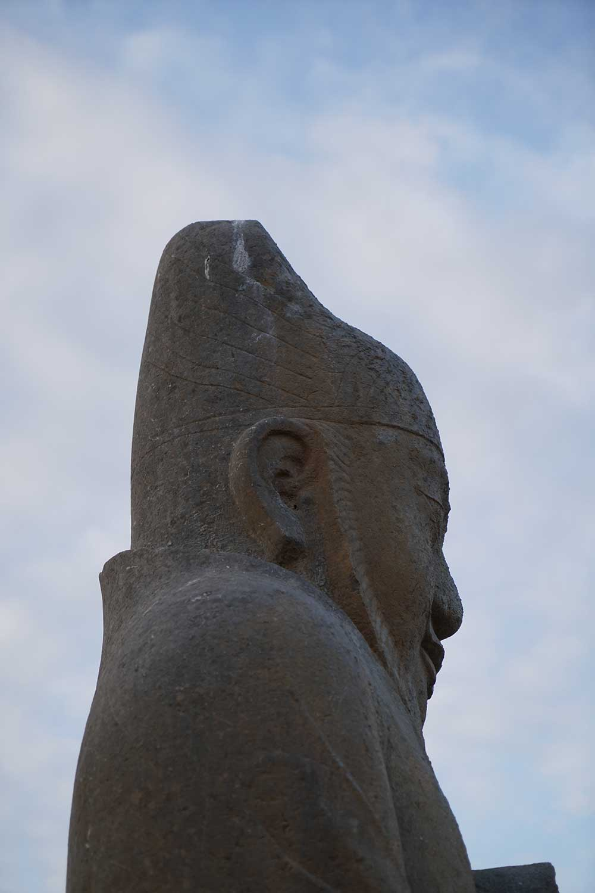
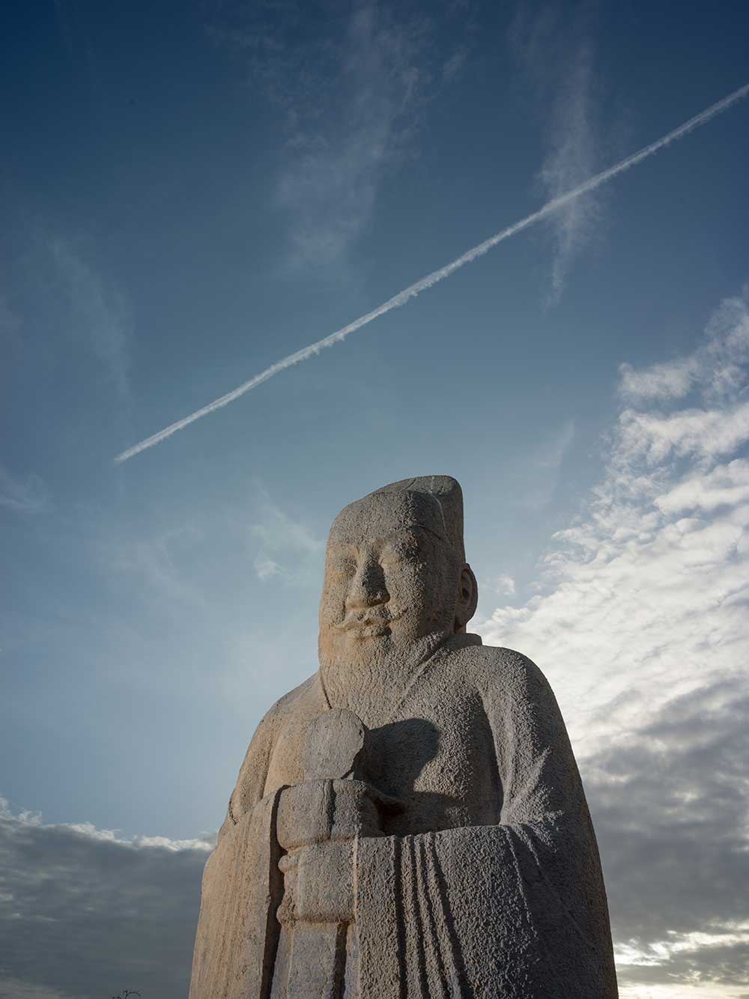
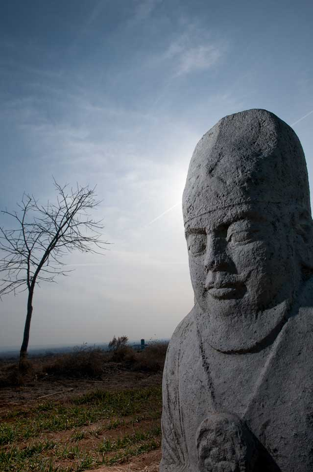

### 唐中宗李显（公元656年—710年）

公元656年，李显生于长安，是唐高宗李治的第七子，武则天的第三子。根据《旧唐书》记载，李显初封周王，后改封英王，章怀太子以“忤逆”罪被武则天废为庶人后，李显被立为皇太子。公元683年李显继承皇位，尊武则天为皇太后。李显称帝后，试图丰满自己的羽翼而重用韦后外戚。但在同年二月，继皇位55天的李显被武则天废为庐陵王。公元698年，狄仁杰的劝谏武则天“陛下立子，则千秋万岁后，配食太庙，承继无穷。”，三月，皇嗣李旦逊位于庐陵王。公园705年，武则天病重，右羽林大将军李多祚率禁军逼武则天让位于李显。李显其在位初期阶段“一应典制，悉复唐永淳前旧，唐朝规复”。同时李显对吐蕃实行和亲政策，把金城公主嫁给吐蕃赞普尺带珠丹，保证了边疆地区的稳定，促进了汉藏文化的交流。但在其执政的后期因为放纵韦后和其胞姐安乐公主，使得朝政腐败。公元710年，李显被欲仿则天之事的韦后毒死在神龙殿，终年55岁，谥号大和大圣大昭孝皇帝，葬于定陵。

### 陵园形制与规模

唐中宗定陵位于今陕西富平县北十二公里的宫里镇三凤村北海拔751米的凤凰山。陵园为长方形，定陵陵园座北面南，东西宽二公里，南北长三公里，周长十公里。有四门，左青龙、右白虎、南朱雀、北玄武，门外各有门阙，朱雀门外乳台和鹊台。定陵营建时，正值盛唐，陵园规模宏大，石刻气势磅礴、造型高大雄伟，与唐高宗乾陵、唐睿宗桥陵、杨氏顺陵石刻一脉相承，其艺术精湛。是唐帝陵石刻艺术宝库中最为精华的部分。不过在李显下葬50年前后，定陵就屡次遭受焚毁和盗掘之灾。公元716年，定陵寝殿焚，公元765年，党项、羌族入侵富平，再次将定陵焚毁。五代时，定陵遭耀州节度使温韬盗掘，受到极大的破坏，宋太祖赵匡胤曾于公元961年和公元970年两次诏令修葺定陵。清乾隆四十一年（公元1776年）陕西巡抚毕沅，在定陵树碑封墓。

### 陵园石刻

经过1300余年的岁月磨痕，又经过多种政治变迁及周遭民众盗取石材凿造器物，陵园石刻保存数量较少，但在2016年陕西文物考古发掘中找到朱雀门五尊身高4米左右的完好翁仲雕像，尤以西侧第三尊为雄壮威武，鹘饰有飞鹘，冠后饰卷云纹均为阴刻纹样。同时发现一尊残缺的蕃酋像，根据其背部题刻"金义让"，推测其为唐中宗时期的新罗遣唐使金思让。东门及玄武门仅存残破石狮、石马。据刘庆柱1987年撰写的《陕西唐陵调查报告》称，“文革”前，定陵神道石刻保存较多，仅南神门就有其石柱一个、翼马一对、帐马三对、石人五对、蕃民石像一对、立狮一对、无字碑一通等24座石雕。