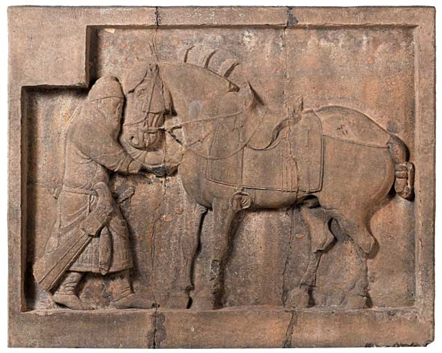
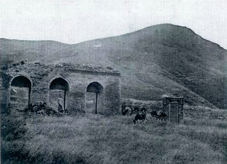

### 唐太宗李世民(公元599年—649年)

李世民，公元599年生于今陕西武功，是唐高祖李渊和窦皇后的次子。公元617年，李世民随父亲李渊起兵反隋，立下赫赫战功。唐朝建立后，李世民官居尚书令、右武候大将军，受封为秦国公，后晋封为秦王。公元626年，发动“玄武门事变”，杀死太子李建成、齐王李元吉及二人诸子，被高祖李渊立为皇太子。同年八月，高祖禅位于太子李世民，李世民即位，改元贞观。

李世民即位后吸取隋亡的经验教训，推用贤良，改革兵粮税制，巩固中央集权。对内以文治天下，虚心纳谏，国泰民安。对外开拓疆土，设立安西四镇，并实行开明的民族融合政策，平等互利，促进了华夏各民族的融会贯通，使文化、经济等都有长足的发展，史称“贞观之治”。

公元649年（贞观二十三年），李世民病逝于终南山翠微宫含风殿，葬于九嵕山，号昭陵。

### 陵园位置与规模

昭陵位于今陕西省礼泉县城东北22.5公里处的九嵕山主峰。海拔1224.9米，山势突兀险峻，地处泾渭之间，气势壮观。《旧唐书·太宗本纪》记载太宗对待臣说“昔汉家皆先造山陵，既达始终，身复亲见，又省子孙经营，不烦费人工。我深以此为是。古者因山为坟，此诚便事，我看九嵕山孤耸回绕，因而傍凿，可置山陵处。朕实有终焉之理”。公元636年，长孙皇后去世，太宗下令建造昭陵。

昭陵是唐代帝王“因山为陵”的第一座陵墓，一为“节省民力”，二为“奸盗悉心”。陵寝在山峰开凿石洞，在山底部修建地下玄宫。陵山四周有城垣环绕，四角建有阙楼，南北两面城垣上各开一门分别为朱雀门和司马门。昭陵建设持续了13年之久，周长60公里，占地面积200平方公里，共有180余座陪葬墓，是中国历代帝王陵园中规模最大、陪葬墓最多的一座。

### 陵园石刻

昭陵石刻，现仅余“昭陵六骏”，其中2匹在美国宾夕法尼亚大学，4匹陈列在陕西省碑林。昭陵石刻还余有十四国蕃酋长石像的残迹，这些酋长石刻像中有曾经在公元626年围攻长安的突厥颉利，后于李世民在渭河桥头签订“刑白马设盟”最终归顺大唐，并被任命左将军之职；还有被封为右骁卫将军的龟兹王黎布失毕、被册封为左卫大将军的焉耆王龙突骑支、吐蕃赞府松赞干布等。但是这些雕像早在五代十国时期就被毁坏，现在仅残留七个石像座及一个石像的上半身和部分残缺头像。