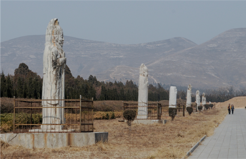

### 唐睿宗李旦 (公元662年—716年)

睿宗李旦，初名李旭轮，生于长安大明宫太液池南岸的蓬莱宫含凉殿内，是高宗李治的第八个儿子，武则天所生第四子。公元681年，改名为李旦，封为豫王。公元684年，武则天废皇帝李显为庐陵王，立时年22岁的豫王李旦为新帝。公元690年，武则天改唐建周。李旦被降为皇嗣，赐姓武，徙居东宫。公元698年，武则天将废黜为庐陵王的李显召回，李旦将皇太子身份让于李显，被封为相王。公元705年，太子李显即位，是为唐中宗。公元710年，睿宗李旦的第三子李隆基和妹妹太平公主等人联络京城禁军将领果毅（禁军将领职称）陈玄礼、葛福顺等拥兵入宫，发动又一次玄武门之变，诛杀欲图把持朝政的韦后及其党羽。拥立李旦重新登基。公元712年，李旦禅位于李隆基，称太上皇。公元716年，睿宗驾崩，享年五十五岁，葬于桥陵。

### 陵园位置与规模

桥陵位于陕西省蒲城县城西北约15公里、海拔751米的丰山（唐朝时称为“桥山”，又称“苏愚山”）之上，历史上丰山曾称作“金帜山”和“金粟山”。此山北面山势屹立崇峻，蜿蜒高耸；而南面是一望无际的沃野之地，与长安相距100公里，遥遥相望。其远观走势展翅欲飞，亦被当地人称为凤凰山。桥陵以丰山主峰为陵，在山腹开凿地下宫室安放棺椁，在地面上绕山筑城，周长达约13公里。桥陵营造崇厚，据记载，桥陵当时地面建筑除雄伟的九间献殿外，还有几座阙楼及下宫、陵署等。陵园设有陵台令及主文、主乐、主辇、典事等官员23人，陵户400人，还设有折冲府，专门有官兵负责保卫工作。

### 陵园石刻

桥陵建造为唐代鼎盛时期，亦是“三年一上计，万国趋河洛”的“开元盛世”。这时国力强盛，社会升平，在陵墓石刻艺术造型中，也就力求展现宏大、壮丽的富贵气象，陵墓建制更是显现其高大宏伟之态。桥陵石刻的设置品类，与女皇武则天乾陵陵园大体基本相同，其中翁仲身高3.67-4.28米的高度相比乾陵翁仲3.75-4.16米更显高大，造型更接近于中宗定陵，其眉宇之间和形态造型更富写实性。陵园现存石刻50件，分布于内城四门外两侧，以南神门外最多，排列在长625米，宽110米的司马道两侧。