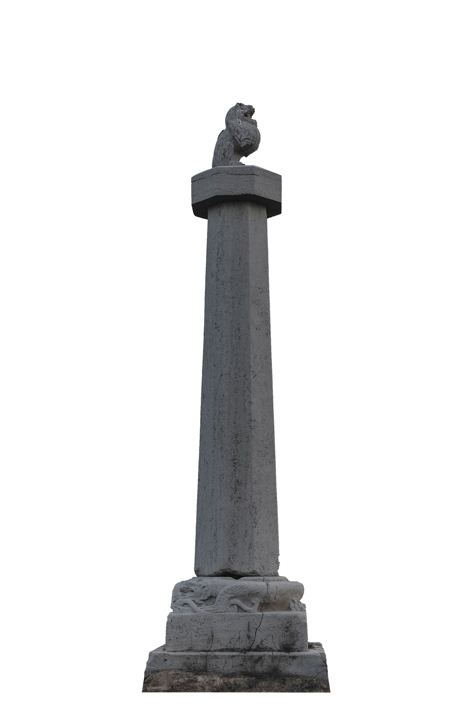

### 唐高祖李渊 (公元566 年—635年)

李渊，字叔德，陇西狄道人（今甘肃临洮）。十六国时期西凉太祖武昭王李暠之后。李渊七岁袭封唐国公，先后在北周和隋两朝任职。公元617年，李渊率领义兵三万人于太原起义。公元618年，隋恭帝杨侑禅位于李渊，李渊改国号为唐，建立了唐朝，定都长安（今陕西省西安市）。

公元626年，李渊禅位于李世民，自称太上皇，在位九年。公元635年，李渊崩于京都长安城太安宫，终年70岁，葬于献陵。李渊死前曾下诏“既殡之后，皇帝宜于别所视军国大事。其服轻重，悉从汉制，以日易月。陵园制度，务从俭约。斟酌汉魏，以为规矩”。宰相房玄龄等以东汉光武帝刘秀的原陵高六丈为制度来建造（汉高祖长陵高九丈），采用平地起坟的方式，历时4个月完成。

### 陵园位置与规模

献陵位于渭北高原上的徐木原（今陕西三原县城东北约20公里处），唐代称之为万寿原。徐木原属吕梁山的支脉北山山脉，虽然海拔只有500米，但视野开阔，西北可远望嵯峨、北仲两山；东北部是石川河。西侧4公里处为唐武宗李炎的端陵，再西侧6.5公里处是敬宗李湛的庄陵。献陵坐北朝南，封土呈覆斗形，高21米，底径东西150米，南北120米，夯筑城恒，四面分别为青龙，朱雀，白虎，玄武四门。朱雀门外设神道，长575米。

### 陵园石刻

陵园石刻献陵石刻维持了南北朝的特点，体积较大，浑厚质朴。现余八棱蹲兽顶华表1对、独角犀牛1对等大型石刻。献陵放置的石虎、石犀的做法是唐代诸陵中独一无二的。献陵四门现存六件石虎，南门现存东侧石虎，西门两只石虎，置立于石座，腿均残，北门现存西侧石虎，腿已断，东门地面可见北侧石虎，仅露出背部，南侧石虎完全掩埋于地下，南神道地面现存石刻为东侧石柱和西侧石柱底座。1959年，碑林博物馆将神道东侧犀牛及南门西侧石虎移置馆中，其余皆在原址。